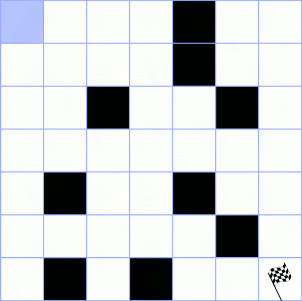

# BFS-DFS

## Exercício

Atividade avaliativa sobre o caminhamento em labirinto. Nesta atividade, cada dupla de alunos deve entregar um trabalho contemplando BFS e DFS.

O labirinto em si é uma matriz quadrada de tamanho N e o objetivo é partir da coordenada inicial (0,0) até a coordenada final (N-1,N-1). Esta matriz possuirá barreiras, que são meramente coordenadas que não podem ser visitadas.

BFS e DFS são os métodos que serão utilizados para caminhar por esta matriz. O método BFS (Breadth-First Search), também conhecido como Busca em Largura, é um algoritmo de busca que têm como ideia principal começar no vértice raiz, do grafo ou matriz, explorando e visitando todos os vértices vizinhos possíveis e têm como estrutura uma fila. Já o método DFS (Depth-First Search), Busca em Profundidade, visa explorar os vértices vizinhos porém visitando apenas um deles e podendo retornar ao vértice anterior caso não seja possível continuar o caminho, têm como estrutura uma pilha.

Além de chegar no final, foi pedido pelo professor que fossem contadas a quantidade de atualizações que ocorreriam na Fila (no caso do BFS) e na Pilha (no caso do DFS) para comparação.

## Entrada

Para o programa funcionar é necessária uma única entrada do usuário. Ela se dá por meio de um arquivo chamado **input.txt**. Este arquivo deve estar na pasta principal do programa junto do makefile. Além disso, ele possui uma formatação própria bem simples e que serve como base para a criação da matriz que os algoritmos serão executados.

Essa formatação se dá por duas etapas, a primeira é um único número logo na primeira linha do arquivo. Este número irá representar o tamanho da matriz que o usuário deseja que o algoritmo rode. Para os exemplos que vamos testar depois o tamanho da matriz será 7, logo, a primeira linha do nosso arquivo será 7:

```
7
```

Com esta única linha o programa já rodará criando uma matriz 7x7 sem nenhum tipo de barreira.

A segunda etapa é a introdução das barreiras. Para isso, a partir da segunda linha do arquivo, coloque o par de coordenadas que se deseja criar uma barreira. Esta coordenada deve levar em conta o próprio tamanho da matriz, além de que estamos usando um programa que trabalha com o valor inicial (0,0). Então em uma matriz 7x7, como a do exemplo, a maior coordenada possível é(6,6). Qualquer coordenada com um valor maior que o limite da primeira linha ou menor que 0 provocará erros na execução do programa. Para a introdução desta coordenada é necessário simplesmente que coloque a coordenada do eixo X, uma vírgula, a coordenada do eixo Y. Para a introdução de novas barreiras, sempre coloque na próxima linha, sendo uma barreira nova por linha. A entrada que será testada no nosso exemplo será esta:

```
7
0,4
1,4
2,2
2,5
4,1
4,4
5,5
6,1
6,3
```

Assim, a matriz de entrada em nosso teste é:

<center></center>

## Programação
Para a construção dos nossos algoritmos, utilizou-se como base os códigos disponibilizados pelo professor, de <a href="https://github.com/mpiress/dynamic_queue">Fila dinâmica</a> para o BFS, e, <a href="https://github.com/mpiress/dynamic_stack">Pilha dinâmica</a> para o DFS.

Após a entrada de dados com as posições dos obstáculos e o tamanho da matriz, o programa transforma todas as posições informadas em '#' e todas as que sobraram em '0', ou seja, o algoritmo só caminhará em uma determinada posição caso esta apresente o '0'.

O algoritmo possui quatro funções principais que se dividem nos dois tipos de estruturas e se diferenciam pela primeira letra da função, <em>'F'</em> para fila e <em>'P'</em> para pilha. As funções são as seguintes: <code>AndarBaixo</code>, <code>AndarDireita</code>, <code>AndarCima</code> e <code>AndarEsquerda</code>.

### <strong> BFS </strong>
Para a movimentação do BFS, a função de movimentação possui seguinte estrutura:

### Parâmetros: <code>(int **matriz, Fila *f, int n, int *contagem)</code>

Cria-se: um inteiro <code><em>aux</em></code> que pegará a próxima posição da matriz na direção do movimento da função, um <code><em>NovoItem</code></em> de tipo <em>Item (que possui os inteiros linha e coluna)</em> que armazenará a nova posição caso o caminho possa ser feito. Para que o algoritmo não tente caminhar sobre uma 'parede' da matriz ou atravessar um obstáculo, um <code>'if'</code> que verifica se a próxima posição é uma parede ou um obstáculo é suficiente para que o programa pule para a próxima direção de caminho. Caso o caminho esteja aberto, transforma-se, então, a posição atual da matriz em '1', completa o passo para a dada direção e, após isso, enfilera-se a posição e incrementa-se um no contador de iterações <code> *contagem</code>.

Após o programa verificar todos os vértices vizinhos da posição atual, esta é desenfileirada e continua-se a partir das outras posições enfileiradas a partir daquela.

Segue abaixo uma demonstração de como nosso algoritmo de BFS se comporta dada a entrada colocada anteriormente, os vértices em preto são os obstáculos, os em lilás são as posições atuais, os verdes as futuras posições e os vermelhos o caminho percorrido.:

<center></center>

### <strong> DFS </strong>
Para a programação do DFS, houveram algumas mudanças a partir do algoritmo BFS. Agora, a função apresenta a seguinte estrutura:

### Parâmetros: <code>(int **matriz, Pilha *p, int n, int *contagem)</code>

Cria-se: um inteiro <code><em>aux</em></code> que pegará a próxima posição da matriz na direção do movimento da função, um <code><em>NovoItem</code></em> de tipo <em>Item (que possui os inteiros linha e coluna)</em> que armazenará a nova posição caso o caminho possa ser feito. Para que o algoritmo não tente caminhar sobre uma 'parede' da matriz ou atravessar um obstáculo, um <code>'if'</code> que verifica se a próxima posição é uma parede ou um obstáculo é suficiente para que o programa pule para a próxima direção de caminho. Caso o caminho esteja aberto, transforma-se, então, a posição atual da matriz em '1', completa o passo para a dada direção e, após isso, empilhaa-se a posição e incrementa-se um no contador de iterações <code> *contagem</code>. Agora, a função é booleana e retorna <code>true</code> caso conclua o passo dado.

Na chamada da função no <code>main()</code> há agora uma variável booleana <code>pAndou</code> que verificará caso o passo foi dado. Se nenhuma função retornar <code>true</code> o algoritmo transforma a posição atual da pilha em um obstáculo desempilha a mesma e continua a verificar a partir da anterior.

Segue abaixo uma demonstração de como nosso algoritmo de DFS se comporta dada a entrada colocada anteriormente, os vértices em preto são os obstáculos, os em lilás são as posições visitadas, os vermelhos as posições que foram transformadas em obstáculo e o verde a posição final.:

<center></center>

## Saída

A saída do programa é em ordem:
A matriz do BFS final com 1's em todos os pontos visitados pelo método, 0's para os não visitados e # para as barreiras. Em sequência a esta matriz vem a quantidade de iterações feitas caso tenha sido possível chegar em seu objetivo final.

Em seguida, vem a matriz do DFS, com 1's no caminho final da pilha, com 0's para os não visitados e # para as barreiras e os pontos que foram visitados e retornados depois. Em sequência a esta matriz vem a quantidade de iterações feitas caso tenha sido possível chegar em seu objetivo final.

Com a entrada exemplificada, a saída será possível em ambos os casos, sendo neste caso específico o DFS muito mais eficiente do que o BFS, como é possível ver pela saída final:

<center></center>

# Compilação e Execução

O exercício disponibilizado possui um arquivo Makefile cedido pelo professor que realiza todo o procedimento de compilação e execução. Para tanto, temos as seguintes diretrizes de execução:


| Comando                |  Função                                                                                           |                     
| -----------------------| ------------------------------------------------------------------------------------------------- |
|  `make clean`          | Apaga a última compilação realizada contida na pasta build                                        |
|  `make`                | Executa a compilação do programa utilizando o gcc, e o resultado vai para a pasta build           |
|  `make run`            | Executa o programa da pasta build após a realização da compilação                                 |

É recomendado fazer um `make clean` antes de um `make`.
